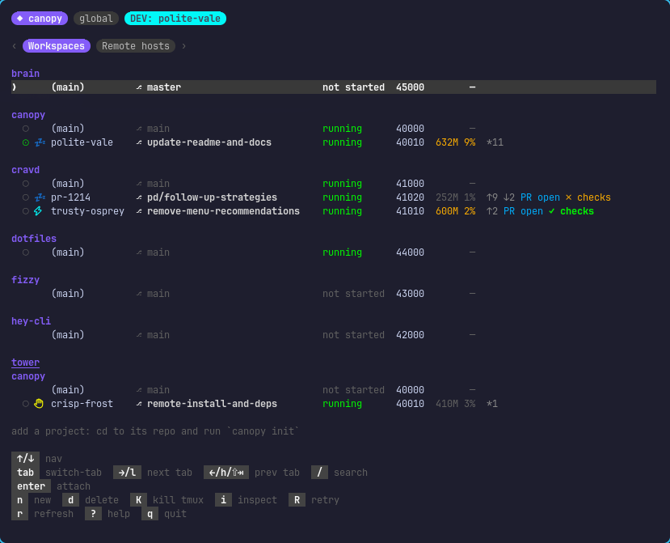
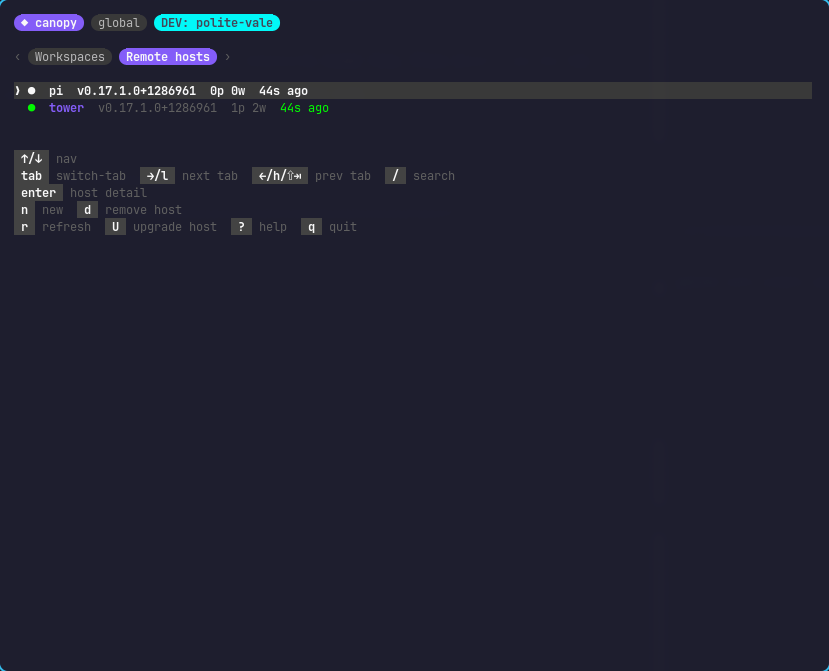

```
   _____
  / ____|
 | |     __ _ _ __   ___  _ __  _   _
 | |    / _` | '_ \ / _ \| '_ \| | | |
 | |___| (_| | | | | (_) | |_) | |_| |
  \_____\__,_|_| |_|\___/| .__/ \__, |
                         | |     __/ |
                         |_|    |___/
```

[](https://pkg.go.dev/github.com/avinashjoshi/canopy)
[](https://goreportcard.com/report/github.com/avinashjoshi/canopy)
[](https://github.com/avinashjoshi/canopy/actions/workflows/test.yml)
[](LICENSE)

**TUI for managing git worktrees with paired tmux sessions, per-project setup hooks, and remote-host dispatch.**

> Status: v0.20, daily-driven by the author. APIs and on-disk state may still shift before v1.



`canopy new` and ten seconds later you're attached to a tmux session with `nvim`, `claude`, and a shell, all on a fresh git worktree against an isolated database with its own port. Reboot your laptop, `canopy switch <name>`, and you're back exactly where you left off — claude conversation included. Run `canopy new --on tower --prompt "fix the timezone bug"` and the same workspace lands on a beefier remote box while you keep working on your laptop.

## Why canopy?

AI-paired development means many parallel branches in flight at once: one agent refactoring auth, another fixing the timezone bug, plus the feature you're driving by hand. Raw `git worktree` + ad-hoc `tmux new-session` doesn't scale past three. Canopy is the missing orchestrator: per-workspace ports, per-workspace databases via `scripts.setup`, per-workspace tmux sessions with the same layout every time, agent-state badges so you can see which agent needs you, and one TUI that views every workspace across every host. See [`docs/landscape.md`](docs/landscape.md) for where canopy sits next to Conductor, tmuxinator, raw `git worktree`, and the agent CLIs it hosts.

## What's new in v0.20

- **Add a project from anywhere.** `canopy init` now accepts a folder path or a git URL, so you can register a project without `cd`-ing into it: `canopy init ~/code/foo` or `canopy init https://github.com/foo/bar.git`. URL form clones into your configured source-root (default `~/.canopy/sources`, override via `canopy config set source-root ~/Work`) and registers in one shot. A new TUI **Add Project** form lives on the splash and on the Global tab (`a` keybind), with `Tab` to cycle between local and registered hosts. See [`docs/getting-started.md`](docs/getting-started.md).
- **Remote-host init.** `canopy init <git-url> --on tower` dispatches the clone+init to the remote canopy via SSH (reusing v0.17's ControlMaster plumbing) and auto-registers the new project in the laptop's `hosts.json` so the next `canopy new --on tower` resolves cleanly — no more manual `canopy project add` after init.
- **`canopy config` subcommand.** Persistent user-level settings at `~/.canopy/config.json`. First key is `source-root`. Precedence: per-call dest > `$CANOPY_SOURCE_ROOT` env > config file > built-in default. Get/set/list/unset, with `(env)` / `(config)` / `(default)` source labels so you can debug why a value isn't taking effect. Press `,` from any TUI tab to open the settings modal.

## Previous releases

- **v0.17** — Remote workspaces. Register an SSH-reachable host once with `canopy host add tower cassy@tower.tail.ts.net`, then run `canopy new --on tower` from your laptop. The heavy work runs on the host; one TUI views every workspace across every machine. See [`docs/remote-workspaces.md`](docs/remote-workspaces.md). Plus fire-and-forget agents (`canopy new --prompt "..." --no-attach`), in-TUI `canopy upgrade`, and workspace identity that follows the branch (rename via `git branch -m` and canopy's tmux session, statusline, terminal-tab title, and TUI rows pick up the new name within 15 seconds).
- **v0.18 / v0.19** — TUI picker for `canopy use`; remote workspace observability (live ⚡ claude badge across SSH, ⊙ attached-client indicator, confirm-attach modal for remote rows, "⚠ stale Ns" pill when refresh data goes cold).

## Features

From inside any project that has a `canopy.json`:

```bash
canopy new                              # workspace with a random name (e.g. bold-falcon)
canopy new --name fix-bug               # explicit name
canopy new --prompt "fix the bug" --no-attach   # fire-and-forget claude
canopy new --pr 1214                    # check out a GitHub PR into a workspace
canopy new --issue 42                   # fresh branch, briefing seeded from issue body
canopy new --branch existing-feature    # check out an existing remote branch
canopy new --on tower                   # dispatch to a remote host
canopy init <url>                       # clone a git URL + init in one shot (v0.20)
canopy init <url> --on tower            # same, dispatched to a remote host (v0.20)
canopy main                             # tmux session anchored at the project root
canopy ls                               # workspaces in the current project
canopy ls --all                         # everything across every project + remote host
canopy switch <name>                    # attach (resurrect first if stopped)
canopy switch --on tower foo            # attach over mosh+tmux to a remote workspace
canopy rm <name>                        # tear down (archive script + tmux + git + branch)
canopy retry <name>                     # re-run scripts.setup on a broken workspace
canopy rename [<name>]                  # sync labels to the current branch (--pin/--unpin)
canopy reconcile                        # update statuses to match disk + tmux reality
```

Each workspace gets a 3-pane tmux session: `nvim` top-left, an agent (`claude` by default, with `--continue` on resurrect) top-right, and a shell full-width on the bottom. `scripts.run` (your dev server) launches on demand via `canopy run` rather than auto-starting — that way a stopped workspace resurrects to the same layout without a port collision.

Workspaces live at `~/.canopy/workspaces/<project>/<name>` — canopy owns the storage so your source repo stays clean — and each one gets a unique TCP port via `CANOPY_PORT`.

`canopy` with no args launches a Bubbletea TUI: tabbed views (current project / Global / Remote hosts), arrow-key navigation, `enter` to attach, `n` to create, `d` to delete, `i` to inspect, `U` to upgrade, `?` for help. CLI subcommands work alongside it; both call into the same `workspace.Manager` underneath.

Plus operational glue:

- `canopy init [path-or-url] [dest]` — onboard a project. Three shapes: `canopy init` inits the cwd (creates `canopy.json` + stub `bin/canopy-*` scripts; detects `conductor.json` and adopts its schema); `canopy init ~/code/foo` inits a folder without `cd`-ing in; `canopy init <git-url>` clones + inits in one shot. Add `--on <host>` to dispatch the whole flow to a registered remote canopy. (v0.20)
- `canopy config set|get|list|unset` — user-level prefs at `~/.canopy/config.json`. First key is `source-root` (where `canopy init <url>` clones). Env override: `CANOPY_SOURCE_ROOT`. (v0.20)
- `canopy host add <name> <ssh-target>` — register a remote canopy host (with `--interactive` for a guided form)
- `canopy project add <name> <path> --on <host>` — bind a project name to a path on a remote (auto-populated by `canopy init <url> --on <host>` in v0.20+)
- `canopy install tmux` — write managed keybinds + statusline into `~/.tmux.conf` (idempotent, backed up)
- `canopy upgrade` — fetch + build the latest release; `--check` for a dry run, `--dismiss` to silence pills until next release
- `canopy use [target]` — flip the active canopy binary between `release` and any in-flight workspace's `./canopy`
- `canopy version` — version, commit, build date, active binary, DEV vs release
- `canopy --debug` — DEBUG-level JSON logs to `~/.canopy/log/canopy.log` (auto-rotated: 10 MB / 3 backups / 28 days / gzip)

### Agent-state badges

Every workspace row in the TUI carries a small badge showing what the agent pane is doing — polled every 2 seconds across every workspace, local AND remote:

| Badge | Meaning |
|---|---|
| `⚡` (cyan) | claude is thinking |
| `💤` (gray) | claude is idle, ready for your next message |
| `✋` (yellow) | claude is awaiting input (y/N or tool-permission popup blocking) |
| `·` (subtle) | workspace has no agent pane (or pane crashed to shell) |

Combined with `canopy new --prompt "..." --no-attach`, this turns canopy into a triage queue: spawn three claudes in parallel, do something else, glance at the TUI to see which one wants you.

### Workspace health badges

The TUI's HINTS column surfaces problems before they bite. All inferred from `git` plumbing on every refresh — no extra config:

| Badge | Meaning |
|---|---|
| `⚠ conflict` | a merge conflict against `origin/<default>` is waiting for you |
| `⚠ rebasing` / `merging` / `pick` / `detached` | git is mid-operation; finish or abort it before doing more |
| `↑N ↓N *N` | N commits ahead of `origin/<default>`, N behind, N dirty files |
| `⇡N` / `⇅` | N commits unpushed to your branch's upstream, or upstream has diverged |
| `↗ rename-suggested` | branch is still on a namegen name (`bold-falcon`) but you've made progress — commits past `origin/<default>` OR tracked-file edits (untracked noise excluded). Try `canopy rename`. |
| PR status | open / approved / merged / closed (via `gh pr view`, polled out of band) |

Stuck-state badges (rebasing, merging, etc.) preempt the `↑N ↓N *N` numbers because those numbers reflect git's transient internal state during the operation.

### Port allocation

Every workspace gets a unique TCP port via `CANOPY_PORT`, allocated through a Conductor-style block plan:

- Each project's first workspace lands on `base_port` (default 40000).
- Subsequent workspaces in the same project step up by `workspace_stride` (default 10): 40010, 40020, 40030, ...
- A new project's first workspace lands `project_stride` higher than the previous project (default 1000): canopy → 40000, cravd → 41000, hey-cli → 42000.

Project-to-base assignments are first-come-first-served and persisted in `state.json`, so a workspace's port is stable across reboots.

Defaults are tweakable via `~/.canopy/config.json` (optional file):

```json
{
  "ports": {
    "base": 40000,
    "project_stride": 1000,
    "workspace_stride": 10
  }
}
```

Partial overrides are fine — any field you skip stays at the default.

### tmux integration

If you live in tmux, three extra subcommands turn canopy into an always-one-keystroke-away workspace switcher and a glanceable status widget. All are inside-tmux-only.

**One-shot install:**

```bash
canopy install tmux       # writes managed block to ~/.tmux.conf (with backup)
tmux source-file ~/.tmux.conf
```

That's it. The installer is idempotent (refuses if already present; `--force` replaces in place), backs up `~/.tmux.conf` before any change, and writes a clearly-marked managed block so you can see what canopy added:

```tmux
# canopy:start (managed by `canopy install tmux` — edit only outside markers)
bind g run-shell "canopy popup"
bind -n C-M-c display-popup -E "CANOPY_IN_POPUP=1 canopy"
set -ag status-right " #(canopy statusline --format=current) "
set -g status-left-length 50
set -g set-titles on
# canopy:end
```

**What you get:**

- **`canopy popup`** — `<prefix>g` opens the global TUI in a tmux floating popup. Tabs: **<project>** (current project's workspaces, default if launched from inside a project), **Global** (everything), **Remote hosts** (registered SSH boxes). `Tab` cycles tabs, `/` enters fuzzy search, `Enter` switches to the selected workspace. Requires tmux 3.2+.
- **`Ctrl+Alt+c`** — no-prefix global chord that launches the same popup. One keystroke from anywhere in your terminal.
- **`canopy run`** — `<prefix>r` execs `scripts.run` (e.g. `bin/dev`) from the nearest `canopy.json` in a tmux popup. Inherits `CANOPY_PORT` and friends from the workspace tmux session.
- **`canopy statusline --format=current`** — appended to `status-right`, shows `<project> / <branch> <glyph> :<port>` when you're attached to a canopy workspace's tmux session, and empty otherwise. When the workspace folder name and branch have diverged (after `git branch -m`), both are shown: `<project> / <wsName> / <branch>`. When you're attached to a remote canopy via `canopy switch --on <host>`, a yellow `@<host>` pill prefixes the line so you can tell at a glance you're working on a remote machine. Errors never propagate to stdout — your status bar stays clean even if state.json is corrupt or canopy crashes.

**Manual install:** paste the block above into `~/.tmux.conf` and `source-file` it.

### Remote workspaces (v0.17)

Workspaces don't have to live on your laptop. Register an SSH-reachable host once:

```bash
canopy host add tower cassy@tower.tail.ts.net
canopy host add tower --interactive          # guided form, runs ssh-copy-id if needed
canopy host ls
```

Bind a project to a remote path:

```bash
canopy project add cravd /home/cassy/Work/cravd --on tower
canopy project ls
```

Then dispatch from anywhere:

```bash
canopy new --on tower                                 # uses the project path from the registry
canopy new --on tower --prompt "fix the bug"          # remote fire-and-forget; prompt travels via base64+temp file, never in `ps`
canopy switch --on tower fix-bug                      # attaches via mosh+tmux (UDP, suspend-tolerant)
canopy switch --on tower fix-bug --share              # multi-attach instead of stealing
canopy rm --on tower fix-bug                          # remote teardown
```

The TUI's **Remote hosts** tab shows every registered host with a live version, last-seen timestamp, and per-host workspace count:



From there:

- `enter` opens a detail drawer with SSH target, projects, last-error
- `n` opens the in-TUI add-workspace picker (Fresh / Prompt; PR / Issue / Branch are hidden because they need remote `gh`)
- `s` drops you into an interactive `ssh` shell on the host (y/N gate first, refreshes when you `exit`)
- `U` runs `canopy upgrade --yes` on the remote, streaming output to the TUI
- `S` runs `canopy use release` on the remote (recovery path for hosts running a DEV binary)
- `a` re-runs `ssh-copy-id` if a host lost key auth
- `d` removes a host (with `F` to force-delete a remote workspace whose worktree is hanging)

End-to-end guide with worked examples: [`docs/remote-workspaces.md`](docs/remote-workspaces.md).

Sample output of `canopy ls --all` with one local and one remote project:

```
TMUX  PROJECT   NAME           BRANCH                    STATUS  PORT   SESSION
●     canopy    (main)         —                         main    40000  canopy/main
●     canopy    polite-vale    update-readme-and-docs    ready   40010  canopy/update-readme-and-docs
●     cravd     (main)         —                         main    41000  cravd/main
●     cravd     pr-1214        pd/follow-up-strategies   ready   41020  cravd/pd-follow-up-strategies
↗     tower     foo            fix-the-bug               ready   40010  canopy/fix-the-bug
```

The `↗` glyph in the TMUX column marks rows that live on a remote host.

## Install

```bash
curl -fsSL https://raw.githubusercontent.com/avinashjoshi/canopy/main/install.sh | sh
```

That clones canopy to `~/.canopy/src`, runs `make install` (which writes the binary to `~/.local/bin/canopy.bin` and symlinks `~/.local/bin/canopy` at it), and prints a PATH hint if `~/.local/bin` isn't on your shell's PATH.

Idempotent: re-running on a machine that already has canopy installed prints "looks like canopy is already installed, run canopy upgrade instead" and exits 0.

### Prerequisites

| Tool | Version | Why |
|---|---|---|
| `git` | 2.x+ | worktree creation per workspace |
| `tmux` | 3.2+ | display-popup support (canopy popup keybind needs this) |
| `go` | 1.22+ | canopy is built from source on install |
| `make` | any | drives the install pipeline |
| `mosh` | 1.4+ (optional) | remote workspace attach (`canopy switch --on <host>`) |
| `ssh` | OpenSSH 8.x+ | remote dispatch + ControlMaster reuse |

`install.sh` enforces the required ones — if any are missing, it prints the exact install command for your OS and exits cleanly. Per-platform install lines:

- **Arch / CachyOS / Omarchy:** `sudo pacman -S git tmux neovim go mosh`
- **Debian / Ubuntu:** `sudo apt-get install git tmux neovim golang-go make mosh`
- **macOS:** `brew install git tmux neovim go mosh`
- **Windows:** canopy needs tmux, which doesn't run natively. Use [WSL2](https://learn.microsoft.com/en-us/windows/wsl/install) and run the Debian/Ubuntu line inside the Linux shell.

Canopy also expects `nvim` and `claude` ([Claude Code](https://docs.claude.com/en/docs/claude-code)) for the default tmux-pane layout — but workspaces can run anything (codex, aider, opencode), so these aren't checked at install time.

### Update

```bash
canopy upgrade
```

That fetches the latest VERSION from `main`, compares with what you're running, prints the CHANGELOG diff, and runs `git pull --ff-only && make install` in `~/.canopy/src`. Refuses cleanly if you're on a dev binary (`canopy use release` first) or if `~/.canopy/src` is missing/corrupt (re-run install.sh).

Flags:
- `canopy upgrade --check` — compare versions without upgrading
- `canopy upgrade --force` — run `git pull` + `make install` even when versions match
- `canopy upgrade --yes` — skip the changelog-confirm prompt (used by in-TUI upgrade)
- `canopy upgrade --dismiss` — silence the in-TUI upgrade pill until the next release ships

Canopy also auto-checks once every 6 hours in the background. When a newer release is out, the TUI's top-bar version pill mutates from `v0.17.1.0` to `v0.17.1.0 ⇑ v0.17.2.0` (yellow arrow), and `canopy ls` ends with one dim hint line. Press `U` inside the TUI to read the changelog in a scrollable viewport and run the upgrade without leaving canopy. Press `D` to dismiss the current available version. On the **Remote hosts** tab, `U` upgrades the selected remote (same streaming UX over SSH).

### Uninstall

```bash
make -C ~/.canopy/src uninstall    # remove ~/.local/bin/canopy{,.bin}
rm -rf ~/.canopy                    # remove the source clone, workspaces, state, and logs
```

The second line is destructive — it nukes every workspace on disk too. Only run it when you really mean to wipe canopy entirely.

### Verify

```bash
canopy version
```

Output looks like:

```
canopy v0.17.1.0+abc1234
  binary:    /home/you/.local/bin/canopy -> canopy.bin
  commit:    abc1234
  built:     2026-05-13T12:34:56Z
  mode:      release
```

If you see `command not found`, `~/.local/bin` isn't on your PATH:

```bash
export PATH="$HOME/.local/bin:$PATH"
```

## Onboarding a project

Run `canopy init` from your project root:

```bash
cd ~/Work/your-project
canopy init                       # writes canopy.json (no scripts)
canopy init --with-scripts        # also writes bin/canopy-{setup,run,archive} stubs
```

Edit the scripts, commit them, then run `canopy new`.

If the project already has a `conductor.json` (Conductor's config — same schema), `canopy init` detects it and copies the script paths verbatim. Your existing `bin/conductor-*` scripts keep working; `CONDUCTOR_*` env vars are exported alongside the canonical `CANOPY_*` ones so the scripts don't need changes. See [`docs/migrate-from-conductor.md`](docs/migrate-from-conductor.md).

### canopy.json schema

```json
{
  "scripts": {
    "setup": "bin/canopy-setup",
    "run": "bin/dev",
    "archive": "bin/canopy-archive"
  }
}
```

Three script paths, all optional. Each script gets the same env vars when canopy invokes it:

| Var | Meaning |
|---|---|
| `CANOPY_WORKSPACE_PATH` | absolute path to the workspace dir |
| `CANOPY_ROOT_PATH` | absolute path to the original repo root |
| `CANOPY_PORT` | allocated TCP port for this workspace |

`setup` runs once at workspace creation; failure flips the workspace to `broken` status (recoverable via `canopy retry`). `run` is the long-running server command, launched on demand by `canopy run` (or `<prefix>r` inside tmux). `archive` runs at workspace removal, before the worktree is deleted.

Full reference, including idempotency tips: [`docs/canopy-json.md`](docs/canopy-json.md).

## End-to-end walkthrough

```bash
# 1. Install
curl -fsSL https://raw.githubusercontent.com/avinashjoshi/canopy/main/install.sh | sh
canopy version

# 2. Onboard a project
cd ~/Work/your-project
canopy init --with-scripts
# … edit bin/canopy-setup, bin/dev, bin/canopy-archive …
git add canopy.json bin/canopy-* && git commit -m "canopy onboarding"

# 3. Install tmux keybinds
canopy install tmux
tmux source-file ~/.tmux.conf

# 4. Create a workspace
canopy new --name fix-timezone
# … you're now attached to a 3-pane tmux session at
#   ~/.canopy/workspaces/your-project/fix-timezone …

# 5. Fire-and-forget a parallel claude
canopy new --prompt "fix the timezone bug in app/models/booking.rb" --no-attach

# 6. Glance at the queue
canopy ls
# Press Ctrl+Alt+c (or <prefix>g in tmux) to open the TUI popup instead

# 7. Resurrect after reboot
canopy switch fix-timezone
# Same layout, claude --continue picks up the conversation

# 8. Ship the workspace
gh pr create
canopy rm fix-timezone    # archive script, drop branch, free port

# 9. (Optional) Add a remote host for heavy work
canopy host add tower cassy@tower.tail.ts.net
canopy project add your-project /home/cassy/Work/your-project --on tower
canopy new --on tower --prompt "expensive refactor" --no-attach
canopy switch --on tower expensive-refactor    # mosh+tmux attach
```

## Contributing

Bug reports and PRs welcome — see [CONTRIBUTING.md](CONTRIBUTING.md) for setup, code conventions, and PR flow.

If you're hacking on canopy itself, you'll have multiple worktrees in flight (one per feature). The active `canopy` on PATH is a symlink — flip it between the released binary and any in-flight feature build with one command, no rebuild on the way back.

```bash
canopy use                       # show current target + list available
canopy use release               # symlink → ~/.local/bin/canopy.bin
canopy use feature-A             # symlink → workspace feature-A's ./canopy
canopy use --build feature-A     # build feature-A's ./canopy first, then switch
```

`make dev` (from inside a worktree) is the muscle-memory wrapper for "build this and make it active"; `make release` flips back to the released binary without a rebuild. The active binary shows up as a `DEV: <workspace>` pill in the TUI top bar and a `[DEV:<workspace>]` suffix in the tmux statusline.

Convention: only run `make install` from main. From feature branches, `make dev` is the right tool — it doesn't touch the released `canopy.bin`, so parallel agents in other worktrees aren't affected.

Full make-task list:

```
make build          # build ./canopy in the worktree (no install, no symlink change)
make install        # build with ldflags, install to ~/.local/bin/canopy.bin, symlink canopy → canopy.bin
make dev            # build + flip ~/.local/bin/canopy at this worktree's ./canopy
make release        # flip ~/.local/bin/canopy back at canopy.bin (no rebuild)
make test           # fast unit tests
make test-e2e       # full E2E suite (real tmux, scratch repo, slow)
make lint           # golangci-lint if installed
make uninstall      # remove ~/.local/bin/canopy and canopy.bin
make clean          # remove ./canopy in the worktree
```

## Documentation

User-facing guides:

- [`docs/getting-started.md`](docs/getting-started.md) — 5-minute tour: install, init, first workspace
- [`docs/remote-workspaces.md`](docs/remote-workspaces.md) — end-to-end guide for v0.17 remote dispatch
- [`docs/landscape.md`](docs/landscape.md) — where canopy fits next to Conductor, tmuxinator, raw `git worktree`, and the agent CLIs it hosts
- [`docs/canopy-json.md`](docs/canopy-json.md) — schema reference + `~/.canopy/config.json` settings
- [`docs/migrate-from-conductor.md`](docs/migrate-from-conductor.md) — step-by-step for projects with `conductor.json`
- [`docs/troubleshooting.md`](docs/troubleshooting.md) — common problems and fixes (local and remote)
- [`CHANGELOG.md`](CHANGELOG.md) — release notes

For contributors:

- [`CONTRIBUTING.md`](CONTRIBUTING.md) — setup, code conventions, PR flow
- [`docs/architecture.md`](docs/architecture.md) — codebase layout, dependency direction, where to add things
- [`docs/design/v0-canopy.md`](docs/design/v0-canopy.md) — design doc with premises, state machine, error conventions
- [`docs/reviews/v0-test-plan.md`](docs/reviews/v0-test-plan.md) — test coverage plan and critical concurrency tests
- [`TODOS.md`](TODOS.md) — deferred work, organized by milestone

## License

[MIT](LICENSE)
