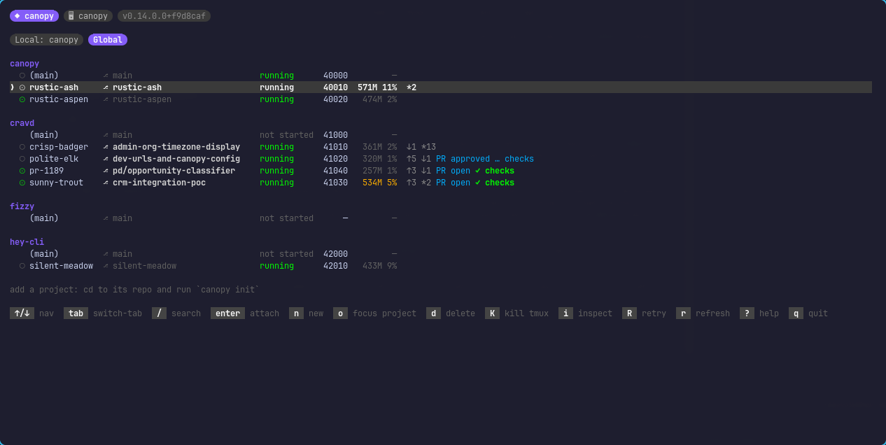

```
   _____
  / ____|
 | |     __ _ _ __   ___  _ __  _   _
 | |    / _` | '_ \ / _ \| '_ \| | | |
 | |___| (_| | | | | (_) | |_) | |_| |
  \_____\__,_|_| |_|\___/| .__/ \__, |
                         | |     __/ |
                         |_|    |___/
```

[](https://pkg.go.dev/github.com/avinashjoshi/canopy)
[](https://goreportcard.com/report/github.com/avinashjoshi/canopy)
[](https://github.com/avinashjoshi/canopy/actions/workflows/test.yml)
[](LICENSE)

**TUI for managing git worktrees with paired tmux sessions and per-project setup hooks.**

> Status: v0.14, daily-driven by the author. APIs and on-disk state may still shift before v1.



`canopy new` and ten seconds later you're attached to a tmux session with `nvim`, `claude`, and a shell, all on a fresh git worktree against an isolated database with its own port. Reboot your laptop, `canopy switch <name>`, and you're back exactly where you left off — claude conversation included.

## Why canopy?

AI-paired development means many parallel branches in flight at once: one agent refactoring auth, another fixing the timezone bug, plus the feature you're driving by hand. Raw `git worktree` + ad-hoc `tmux new-session` doesn't scale past three. Canopy is the missing orchestrator: per-workspace ports, per-workspace databases via `scripts.setup`, per-workspace tmux sessions with the same layout every time, and a TUI that shows which one is hot. See [`docs/landscape.md`](docs/landscape.md) for where canopy sits next to Conductor, tmuxinator, raw `git worktree`, and the agent CLIs it hosts.

## Features

From inside any project that has a `canopy.json`:

```bash
canopy new                  # creates a workspace with a random name (e.g. bold-falcon)
canopy new --name fix-bug   # explicit name
canopy main                 # opens a tmux session in the project root (no worktree)
canopy ls                   # workspaces in the current project
canopy ls --all             # workspaces across every project (also implicit when run outside any project)
canopy switch <name>        # attach (resurrect first if stopped; auto-reconciles status)
canopy rm <name>            # tear down (archive script + tmux + git + branch)
canopy reconcile            # update workspace statuses to match disk + tmux reality
```

Each workspace gets a 3-pane tmux session: `nvim` top-left, `claude` top-right (with `--continue` on resurrect so prior conversation history resumes), and a shell full-width on the bottom. `scripts.run` (your dev server) launches on demand via `canopy run` rather than auto-starting — that way a stopped workspace resurrects to the same layout without a port collision.

Workspaces live at `~/.canopy/workspaces/<project>/<name>` — canopy owns the storage so your source repo stays clean — and each one gets a unique TCP port via `CANOPY_PORT`.

`canopy` with no args launches a Bubbletea TUI — the same workspace list with arrow-key navigation, `enter` to attach, `n` to create, `d` to delete (with confirmation), `U` to upgrade canopy itself when a newer version is available, `?` for help. CLI subcommands work alongside it; both call into the same `workspace.Manager` underneath.

Plus operational glue:

- `canopy init` — onboard a project (creates `canopy.json` + stub `bin/canopy-*` scripts; detects existing `conductor.json` and mirrors its schema)
- `canopy version` — version, commit, build date
- `canopy --debug` — DEBUG-level JSON logs to `~/.canopy/log/canopy.log` (auto-rotated: 10 MB / 3 backups / 28 days / gzip)

### Port allocation

Every workspace gets a unique TCP port via `CANOPY_PORT`, allocated through a Conductor-style block plan:

- Each project's first workspace lands on `base_port` (default 3000).
- Subsequent workspaces in the same project step up by `workspace_stride` (default 10): 3000, 3010, 3020, ...
- A new project's first workspace lands `project_stride` higher than the previous project (default 1000): cravd → 3000, brain → 4000, hey-cli → 5000.

Project-to-base assignments are first-come-first-served and persisted in `state.json`, so a workspace's port is stable across reboots.

Defaults are tweakable via `~/.canopy/config.json` (optional file):

```json
{
  "ports": {
    "base": 3000,
    "project_stride": 1000,
    "workspace_stride": 10
  }
}
```

Partial overrides are fine — any field you skip stays at the default.

### tmux integration

If you live in tmux, two extra subcommands turn canopy into an always-one-keystroke-away workspace switcher and a glanceable status widget. Both are inside-tmux-only.

**One-shot install:**

```bash
canopy install tmux       # writes managed block to ~/.tmux.conf (with backup)
tmux source-file ~/.tmux.conf
```

That's it. The installer is idempotent (refuses if already present; `--force` replaces in place), backs up `~/.tmux.conf` before any change, and writes a clearly-marked managed block so you can see what canopy added:

```tmux
# canopy:start (managed by `canopy install tmux` — edit only outside markers)
bind g run-shell "canopy popup"
set -ag status-right " #(canopy statusline --format=current) "
# canopy:end
```

**What you get:**

- **`canopy popup`** — `<prefix>g` opens the global TUI in a tmux floating popup. Two tabs: **Local** (current project's workspaces, the default if you launched from inside a project) and **Global** (everything). `Tab` switches tabs, `/` enters fuzzy search, `Enter` switches to the selected workspace. Requires tmux 3.2+.
- **`canopy run`** — `<prefix>r` execs `scripts.run` (e.g. `bin/dev`) from the nearest `canopy.json` in a tmux popup. Inherits `CANOPY_PORT` and friends from the workspace tmux session. One keystroke instead of typing `bin/dev`.
- **`canopy statusline --format=current`** — appended to `status-right`, shows `canopy: <name> <glyph> :<port>` when you're attached to a canopy workspace's tmux session, and empty otherwise. Errors never propagate to stdout — your status bar stays clean even if state.json is corrupt or canopy crashes.

**Manual install** (if you prefer to keep your tmux config hand-curated): paste the block above into `~/.tmux.conf` and `source-file` it.

## Install

```bash
curl -fsSL https://raw.githubusercontent.com/avinashjoshi/canopy/main/install.sh | sh
```

That clones canopy to `~/.canopy/src`, runs `make install` (which writes the binary to `~/.local/bin/canopy.bin` and symlinks `~/.local/bin/canopy` at it), and prints a PATH hint if `~/.local/bin` isn't on your shell's PATH.

Idempotent: re-running on a machine that already has canopy installed prints "looks like canopy is already installed, run canopy upgrade instead" and exits 0.

### Prerequisites

| Tool | Version | Why |
|---|---|---|
| `git` | 2.x+ | worktree creation per workspace |
| `tmux` | 3.2+ | display-popup support (canopy popup keybind needs this) |
| `go` | 1.22+ | canopy is built from source on install |
| `make` | any | drives the install pipeline |

`install.sh` enforces these — if any are missing, it prints the exact install command for your OS and exits cleanly. Per-platform install lines:

- **Arch / CachyOS / Omarchy:** `sudo pacman -S git tmux neovim go`
- **Debian / Ubuntu:** `sudo apt-get install git tmux neovim golang-go make`
- **macOS:** `brew install git tmux neovim go`
- **Windows:** canopy needs tmux, which doesn't run natively. Use [WSL2](https://learn.microsoft.com/en-us/windows/wsl/install) and run the Debian/Ubuntu line inside the Linux shell.

Canopy also expects `nvim` and `claude` ([Claude Code](https://docs.claude.com/en/docs/claude-code)) for the default tmux-pane layout — but workspaces can run anything, so these aren't checked at install time.

### Update

```bash
canopy upgrade
```

That fetches the latest VERSION from `main`, compares with what you're running, prints the CHANGELOG diff, and runs `git pull --ff-only && make install` in `~/.canopy/src`. Refuses cleanly if you're on a dev binary (`canopy use release` first) or if `~/.canopy/src` is missing/corrupt (re-run install.sh).

Three flags:
- `canopy upgrade --check` — compare versions without upgrading
- `canopy upgrade --force` — run `git pull` + `make install` even when versions match
- `canopy upgrade --dismiss` — silence the in-TUI upgrade pill until the next release ships

Canopy also auto-checks once every 6 hours in the background. When a newer release is out, the TUI's top-bar version pill mutates from `v0.14.0` to `v0.14.0 ⇑ v0.14.1` (yellow arrow), and `canopy ls` ends with one dim hint line. Press `U` inside the TUI to read the changelog in a scrollable viewport and run the upgrade without leaving canopy. Press `D` to dismiss the current available version.

### Uninstall

```bash
make -C ~/.canopy/src uninstall    # remove ~/.local/bin/canopy{,.bin}
rm -rf ~/.canopy                    # remove the source clone, workspaces, state, and logs
```

The second line is destructive — it nukes every workspace on disk too. Only run it when you really mean to wipe canopy entirely.

### Verify

```bash
canopy version
```

Output looks like:
```
canopy v0.14.0+abc1234
  binary:    /home/you/.local/bin/canopy -> canopy.bin
  commit:    abc1234
  built:     2026-04-30T12:34:56Z
  mode:      release
```

If you see `command not found`, `~/.local/bin` isn't on your PATH:

```bash
export PATH="$HOME/.local/bin:$PATH"
```

## Onboarding a project

Run `canopy init` from your project root:

```bash
cd ~/Work/your-project
canopy init
```

That drops a `canopy.json` plus three stub scripts at `bin/canopy-{setup,run,archive}` for you to fill in. Edit the scripts, commit them, then run `canopy new`.

If the project already has a `conductor.json` (Conductor's config — same schema), `canopy init` detects it and copies the script paths verbatim. Your existing `bin/conductor-*` scripts keep working; just remember to switch any `CONDUCTOR_*` env-var references in your scripts and config files to the `CANOPY_*` equivalents.

### canopy.json schema

```json
{
  "scripts": {
    "setup": "bin/canopy-setup",
    "run": "bin/dev",
    "archive": "bin/canopy-archive"
  }
}
```

Three script paths. Each script gets the same env vars when canopy invokes it:

| Var | Meaning |
|---|---|
| `CANOPY_WORKSPACE_PATH` | absolute path to the workspace dir |
| `CANOPY_ROOT_PATH` | absolute path to the original repo root |
| `CANOPY_PORT` | allocated TCP port for this workspace (3000-3999) |

`setup` runs once at workspace creation. `run` is the long-running server command, launched on demand by `canopy run` (or `<prefix>r` inside tmux). `archive` runs at workspace removal.

## Contributing

Bug reports and PRs welcome — see [CONTRIBUTING.md](CONTRIBUTING.md) for setup, code conventions, and PR flow.

If you're hacking on canopy itself, you'll have multiple worktrees in flight (one per feature). The active `canopy` on PATH is a symlink — flip it between the released binary and any in-flight feature build with one command, no rebuild on the way back.

```bash
canopy use                       # show current target + list available
canopy use release               # symlink → ~/.local/bin/canopy.bin
canopy use feature-A             # symlink → workspace feature-A's ./canopy
canopy use --build feature-A     # build feature-A's ./canopy first, then switch
```

`make dev` (from inside a worktree) is the muscle-memory wrapper for "build this and make it active"; `make release` flips back to the released binary without a rebuild. The active binary shows up as a `DEV: <workspace>` pill in the TUI top bar and a `[DEV:<workspace>]` suffix in the tmux statusline.

Convention: only run `make install` from main. From feature branches, `make dev` is the right tool — it doesn't touch the released `canopy.bin`, so parallel agents in other worktrees aren't affected.

Full make-task list:

```
make build          # build ./canopy in the worktree (no install, no symlink change)
make install        # build with ldflags, install to ~/.local/bin/canopy.bin, symlink canopy → canopy.bin
make dev            # build + flip ~/.local/bin/canopy at this worktree's ./canopy
make release        # flip ~/.local/bin/canopy back at canopy.bin (no rebuild)
make test           # fast unit tests
make test-e2e       # full E2E suite (real tmux, scratch repo, slow)
make lint           # golangci-lint if installed
make uninstall      # remove ~/.local/bin/canopy and canopy.bin
make clean          # remove ./canopy in the worktree
```

## Documentation

User-facing guides:

- [`docs/getting-started.md`](docs/getting-started.md) — 5-minute tour: install, init, first workspace
- [`docs/landscape.md`](docs/landscape.md) — where canopy fits next to Conductor, tmuxinator, raw `git worktree`, and the agent CLIs it hosts
- [`docs/canopy-json.md`](docs/canopy-json.md) — schema reference + `~/.canopy/config.json` settings
- [`docs/migrate-from-conductor.md`](docs/migrate-from-conductor.md) — step-by-step for projects with `conductor.json`
- [`docs/troubleshooting.md`](docs/troubleshooting.md) — common problems and fixes
- [`CHANGELOG.md`](CHANGELOG.md) — release notes

For contributors:

- [`CONTRIBUTING.md`](CONTRIBUTING.md) — setup, code conventions, PR flow
- [`docs/architecture.md`](docs/architecture.md) — codebase layout, dependency direction, where to add things
- [`docs/design/v0-canopy.md`](docs/design/v0-canopy.md) — design doc with premises, state machine, error conventions
- [`docs/reviews/v0-test-plan.md`](docs/reviews/v0-test-plan.md) — test coverage plan and critical concurrency tests
- [`TODOS.md`](TODOS.md) — deferred work, organized by milestone

## License

[MIT](LICENSE)
